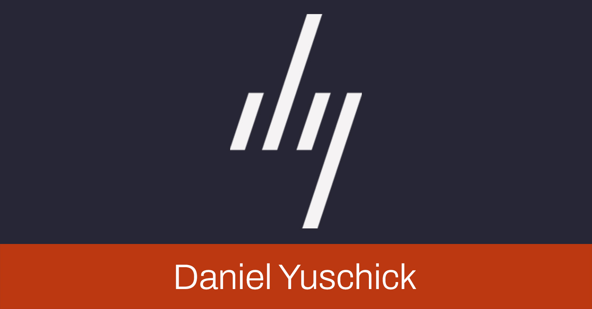

Welcome to my personal website, the defacto testing ground of new technologies and ideas. If I do a
proper write up on this development process, I will add it here. But until then, may I suggest you
[follow me on Twitter](https://twitter.com/DanielYuschick) to follow my ramblings about HTML, CSS,
Accessibility, Design Systems, and Oxford Commas (apparently).

## Goals

-   Simplicity in both design and maintenance
-   Host and own my content
-   Provide an RSS feed
-   Improved accessibility
-   Show more than a developer-specific persona
-   Orange

## Tech Stack

-   [Eleventy](https://www.11ty.dev/)
-   [Nunjucks](https://mozilla.github.io/nunjucks/)
-   [SCSS](https://sass-lang.com/)
-   [Rhubarb CSS - SCSS](https://github.com/rhubarb-css/rhubarb-scss)
-   [Figma](https://www.figma.com/)
-   [Netlify](https://www.netlify.com/)
